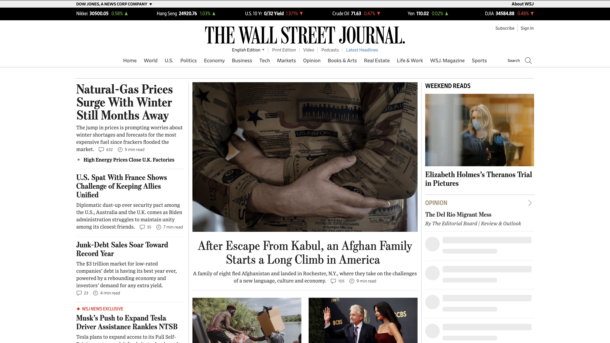

<h1 align="center">Wall Street Journal Clone</h1>

This is a vanilla low fidelity web clone to study how the WSJ layout works and this clone is used for study purposes only.

  <a href="https://github.com/DreamDevourer/Wall-Street-Journal-Clone/blob/main/LICENSE">License</a>

<h2>What is the purpose of this repository?</h2>

This repo was created to save this university project to replicate the layout and language of an existing News website. In this case I choose WSJ.
